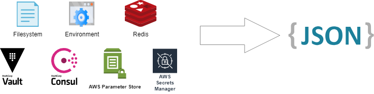

pitstop
=======

.. -begin-short-

**pitstop** lets you move tightly coupled configuration file parsing,
secrets retrieval, and other configuration related administrivia logic
*out* of your application, improving maintainability, reducing
complexity, and encouraging better configuration management practices.
.. -end-short-

Overview
--------

The purpose of **pitstop** is to facilitate application configuration
management best practices, which are:

* Storing environment-specific configuration
  `outside source control <https://12factor.net/config>`_. Environment
  variables, the filesystem, and KV stores are all viable alternatives.
* Storing secrets in a proper secrets management tool, i.e.
  Vault_, `AWS SSM Parameter Store`_, and `AWS Secrets Manager`_, among
  others.

**pitstop** provides a Python 3.7+ library and command line utility,
``pitstop`` (obviously). The CLI provides the ability to leverage
**pitstop**'s functionality without being restricted to writing Python
applications, by reading configuration backends and strategy
configuration from a local file, and emitting a JSON encoded snapshot of
the aggregated application configuration.

.. -begin-features-

**pitstop** stands on the shoulders of mature, feature-rich, and well
tested Python libraries, and merely provides a convenience layer so you
don't have to write the same configuration parsing and normalization
scaffolding with every new library or application.

**pitstop**'s main features:

* **Schema-driven configuration validation and normalization**, powered
  by `Cerberus`_.
* **Nested, path-based key access and transformation**, powered by
  `glom`_.
* **Multi-tiered, prioritized configuration loading strategies.**
* **Easily extensible backends and encoding providers** via
  `entry points`_.

.. _Cerberus: http://docs.python-cerberus.org/en/stable/
.. _glom: https://glom.readthedocs.io/en/latest/
.. _entry points: https://packaging.python.org/specifications/entry-points/

.. -end-features-

.. _Vault: https://www.vaultproject.io/
.. _AWS SSM Parameter Store: https://docs.aws.amazon.com/systems-manager/latest/userguide/systems-manager-paramstore.html
.. _AWS Secrets Manager: https://aws.amazon.com/secrets-manager/
